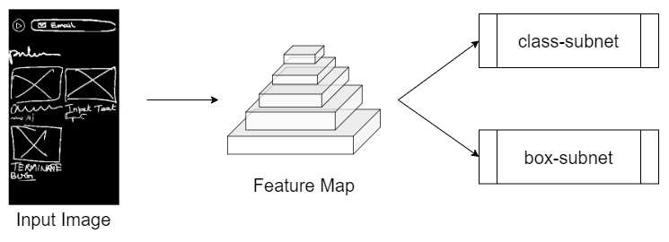
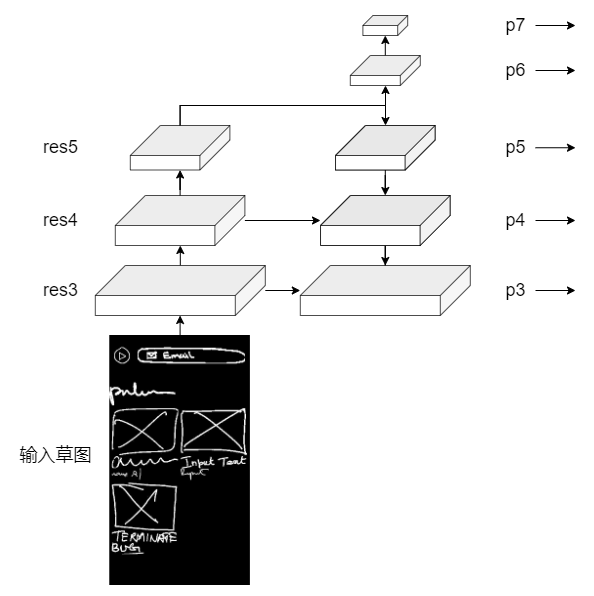
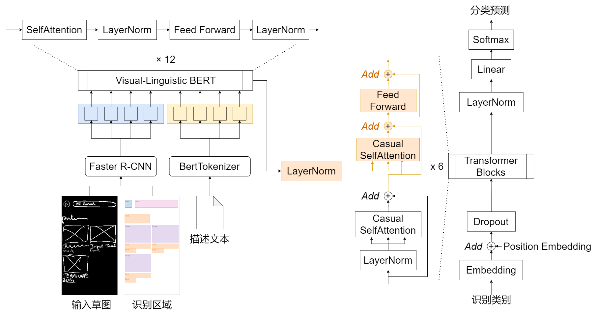
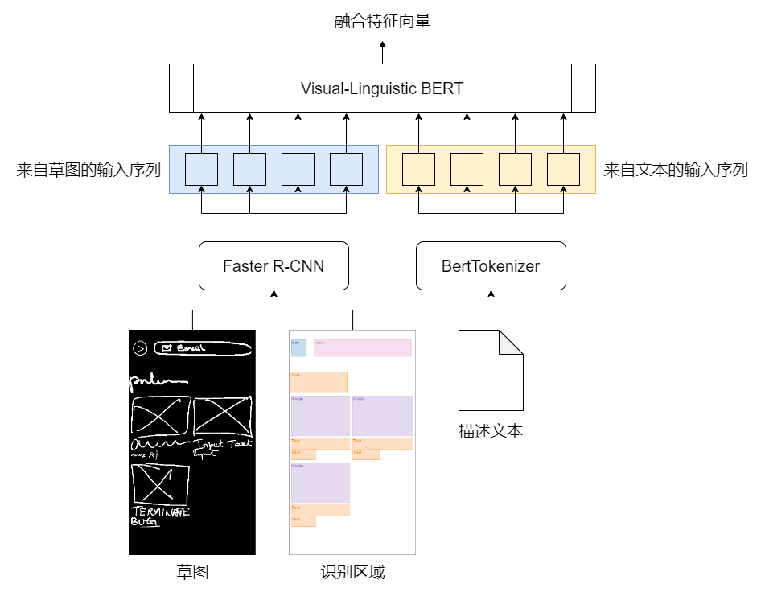
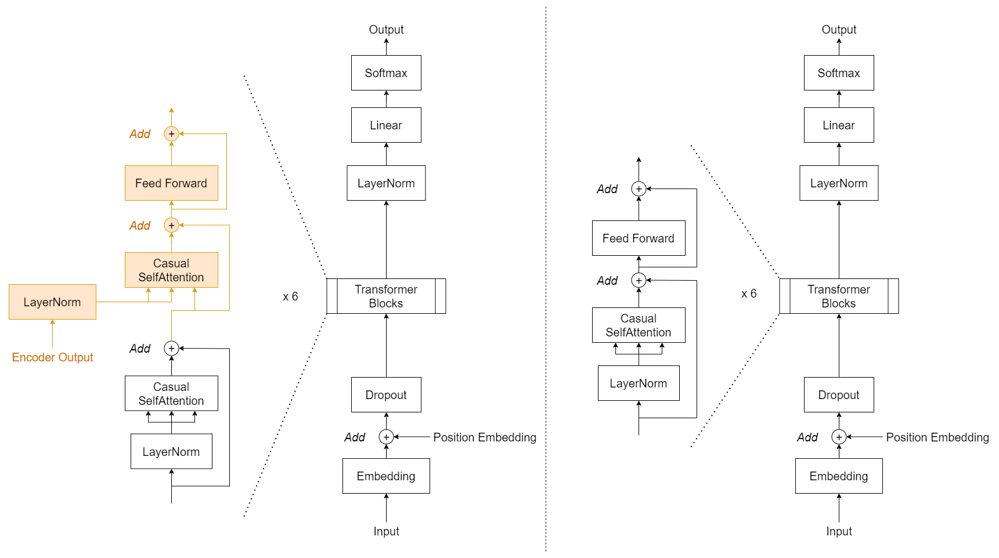
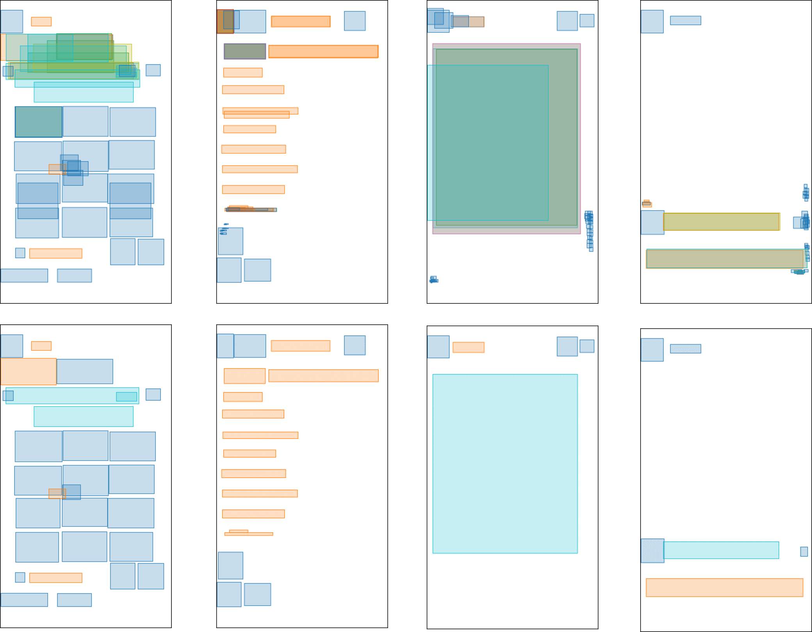
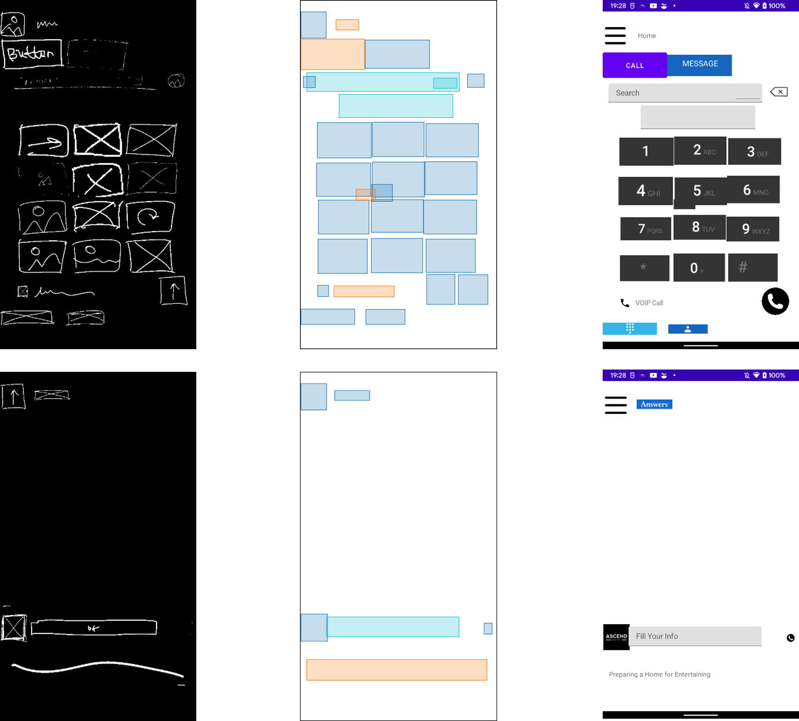

# UI Sketch Detector

本科毕业设计课题。课题目标是 基于给定的设计草图和描述文本，生成完善的页面布局。

## 整体模型设计

整体模型设计方案

### RetinaNet

本部分的实现参考 [SynZ](https://github.com/vinothpandian/synz) 中的设计，网络实现调用了 [detectorn2](https://github.com/facebookresearch/detectron2) 提供的网络，相关内容参考 [RetinaNet 论文](https://arxiv.org/abs/1708.02002)

RetinaNet 部分的整体网络设计

针对输入草图，RetinaNet 的 backbone 为 [Feature Pyramid Network](https://arxiv.org/abs/1612.03144)，得到特征金字塔后使用两个全卷积子网络，分别实现类别预测和边界框回归

特征金字塔的结构

通过左侧自底向上的通路、右侧自顶向下的通路以及横向链接，得到的右侧即为特征金字塔，各部分实现细节如下：

| 名称        |   特征图尺寸   |   特征向量维度   |
|-------------|:------------:|:--------------:|
| Input Image |  640 * 384 |       3      |
|     res3    |   80 * 48  |      512     |
|     res4    |   40 * 24  |     1024     |
|     res5    |   20 * 12  |     2048     |
|      p3     |   80 * 48  |      512     |
|      p4     |   40 * 24  |      512     |
|      p5     |   20 * 12  |      512     |
|      p6     |   10 * 6   |      512     |
|      p7     |    5 * 4   |      512     |

RetinaNet 依照把握由大到小排列，输出模型结果中把握最大的 50 项，包括各项的类别及边界框

> 固定数量的输出为后续网络的设计提供了一些便利，同时也会导致一些问题：数据中的草图元素数量小于 50 项，输出结果中会包含重叠的元素和多余的小面积元素，需要经过后处理消除

### VL-BERT 与 GPT-1

VL-BERT 对应的是 Transformer 结构中的 Encoder，而 GPT-1 对应的是 Transformer 中的 Decoder，两者整合正好构成完整的 Transformer 结构，在训练过程中也将两者连接后一起训练

VL-BERT 与 GPT-1 连接后的结构

#### VL-BERT

VL-BERT 的任务是进行多模态信息的融合，使用了 VL-BERT 预训练模型，具体参考 [论文](https://arxiv.org/abs/1908.08530) 介绍

VL-BERT 部分接收的输入是**草图**、**草图识别结果**及**描述文本**三项

VL-BERT 的整体结构

草图和识别结果提供给 Faster R-CNN 来提取出这些区域的特征向量，描述文本则由 BertTokenizer 进行处理，对文本进行子词粒度的分词，并转化为字典下标的表达形式

Visual-Linguistic BERT 的结构 (Transformer)

Visual-Linguistic BERT 部分参考的是 Transformer Encoder 的结构，对输入序列进行处理，得到的是融合特征

#### GPT-1

GPT-1 部分的任务是基于融合特征，对草图识别得到的类别进行再预测。由于得到了来自描述文本的信息，模型能够更好的理解其中的类别，并对一些识别结果进行调整

采取 GPT-1 模型进行生成的灵感来自于 [LayoutTransformer](https://arxiv.org/abs/2006.14615)

GPT-1 的结构，左侧为本课题的设计，右侧为原 GPT-1 模型

原 GPT-1 模型是基于 Transformer Decoder 进行设计，本课题的修改在于引入了来此 Encoder 的输入，方案参考 [Transformer 论文](https://arxiv.org/abs/1706.03762) 中的描述

### 后处理

通过模型的处理，得到了生成的页面布局元素，其中元素类别由 GPT-1 给出，元素的边界框直接使用 RetinaNet 的识别结果

> 边界框直接使用识别结果的原因是为了简化模型的工作，确保最终效果的整洁且合理。若参考 LayoutTransformer 的生成方案，使用 GPT-1 同时对类别和边界框进行预测，难以得到理想的效果

后处理的任务如下：

1. 筛去多余的元素
2. 对应生成 XML 文件

因为结果中包含 50 个元素，远多于草图中包含的数量，会导致结果中有大量重叠元素和小面积的冗余元素，通过设置面积和 IoU 阈值进行清洗，效果如下：

后处理的效果，上为原始结果，下为处理后效果

为了得到完善的页面效果，采用了规则化的方式生成 XML 文件，放入 Android Studio 构建的 Android 项目，为多媒体标签提供必要的资源，即可在 Android 设备上渲染出最终的效果

XML 的生成采用的是绝对布局，标签类别与 Android Studio 支持的元素类别进行对应（一些不易对应的元素类别不在最终结果中展示）

最终效果，左为输入草图，中为模型结果，右为渲染效果

## 不足与展望

1. 使用 RetinaNet 进行草图的识别效果可以提升，例如尝试应用 Swin Transformer 等更新的识别网络
2. VL-BERT + GPT-1 的模型训练较慢，可以尝试支持多卡，提升训练速度
3. 由于模型的训练问题，课题完成时暂未训练得到较好的模型，也没能验证 **文本的引入对生成结果的影响**
4. 模型在设计上忽视了实际页面设计中的树形结构，而仅视为元素的排布，后续工作可以针对如何还原树形结构进行探索
5. XML 的生成采用了绝对布局，带来的问题是结果无法在不同尺寸和显示比例的设备上很好的呈现

